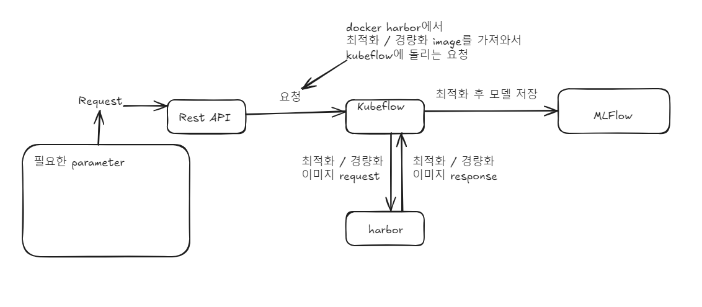

# TRT-Workflow

TRT-Workflow는 모델의 최적화 및 경량화를 쉽게 할 수 있게 도와주는 시스템입니다.
사용자는 이 시스템을 통해서 모델을 입력하고 최적화 및 경량화가 된 모델을 응답받을 수 있습니다.
 

## Tech Stack

 
# Key Features

TRT 기반 워크플로우의 주요 기능은 다음과 같습니다.

1. **경량화/최적화**: REST API를 통해 최적화 및 경량화 시킬 모델과 최적화 방법, 파라미터들을 입력 받은 후, 최적화된 모델을 MLFlow에 저장합니다.
2. **모듈화된 시스템**: Python, FastAPI를 활용한 모듈화된 구조로 쉽게 확장 가능하며, 필요에 따라 모델을 교체하거나 성능을 튜닝할 수 있습니다.
3. **효율적인 모델 관리**: MLFlow를 통해 모델 버전 관리 및 학습 기록을 체계적으로 관리합니다.
 

# System Architecture

 

1. **REST API**: REST API를 통해 최적화 및 경량화 시킬 모델과 최적화 방법, 파라미터들을 입력 받습니다.
2. **Kubeflow**: 요청받은 응답들을 바탕으로 Kubeflow pipeline에 작업을 생성합니다.
3. **경량화/최적화**: pipeline에서 작업을 시작하면, harbor에 저장된 경량화/최적화 docker image를 통해 경량화/최적화를 진행합니다.
4. **모델 관리**: MLFlow를 통해 경량화/최적화 모델을 관리하고, 필요시 모델 업데이트 또는 새로운 데이터 추가가 가능합니다.